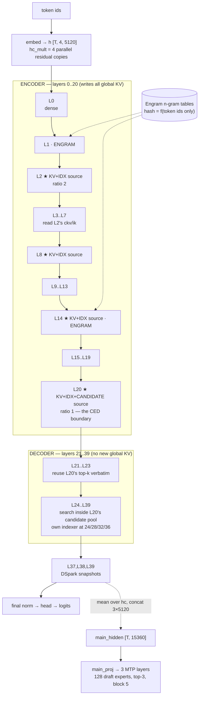
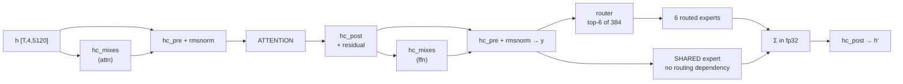
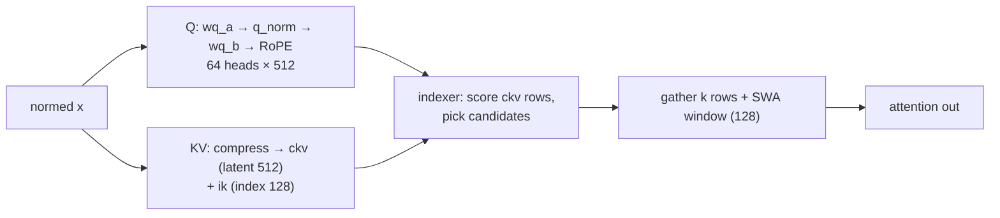

# DeepSeek-V4.1-Flash: what depends on what

The **model's** dependency structure, read out of `inference/config.json` and `tools/v41_ref.py` —
not our engine's schedule. Every number below is from the checkpoint.

This exists because almost every scheduling argument we have had turned on a dependency question:
*can this start before that finishes?* The answer is a property of the model, and it is not obvious
from the layer count.

## The shape in one picture

## Inside one layer — the only true serial chain

**The shared expert needs only `y`.** It does not depend on the router, on any slot, or on any
routed result — yet it is computed after them. That is an implementation choice, not a model
constraint.

**The six routed experts are independent of each other.** Their contributions are summed, so there
is no requirement that they execute together — which is what makes partial/streamed MoE legal.

## Attention's two independent branches

Q and KV share only `x`. Nothing in the Q path needs the KV path until the indexer.

## The cross-layer reuse that makes CED possible

| what | written at | read by |
|---|---|---|
| compressed KV `ckv`, index `ik` | **only layers 2, 8, 14, 20** | every layer up to the next source |
| indexer parameters | 2, 8, 14, 20, **24, 28, 32, 36** | the three layers after each |
| **candidate pool + top-k** | **layer 20** | 21–23 reuse its top-k verbatim; 24–39 search inside its pool |
| Engram rows | tables, keyed by **token ids alone** | layers **1 and 14** |
| DSpark `main_hidden` | layers **37, 38, 39** (snapshot taken *before* the block) | `main_proj` → the 3 MTP layers |

**Four layers of forty write global KV.** That is why the decoder half can be replayed over just the
last 128 positions, and why the whole prompt's KV state is 105 MB rather than the ~1 GB a
40-layer cache would need.

**Engram hashes depend on token ids only** — not on any hidden state. So they are computable for the
entire prompt before layer 0 runs, and they replay deterministically for a cached prefix.

## What this licenses, and what it forbids

**Legal** (dependency genuinely absent):
- Reordering chunks against layers — layer-major prefill. Each layer's experts are needed only by
  that layer.
- Computing the shared expert while routed experts are still arriving.
- Computing some routed experts before others; the sum is order-independent in fp32 accumulation.
- Prefetching Engram rows arbitrarily early.
- Issuing a chunk's expert reads the moment *that chunk* has routed.

**Forbidden** (real dependency):
- Chunk *k+1*'s attention before chunk *k*'s attention **at the same layer** — it reads the KV chunk
  *k* wrote.
- Any layer > 20's attention before layer 20 has produced its candidate pool.
- Layer L+1 before layer L's `h` is complete.
- The MTP draft before the accepted token exists — the drafter is seeded from it.

**Conditional:**
- Chunk *k*'s FFN need not precede chunk *k+1*'s attention at the same layer. Its output is needed
  only at layer L+1. This is a genuine pipeline boundary that layer-major creates and we do not use.

## Sizes, for judging what is worth overlapping

| | |
|---|---|
| routed experts | 384 × 40 = **15,360**, 14.45 MB each in CB3 = 222 GB |
| distinct experts one layer touches on a 2k-token chunk | **~300 of 384**; a whole layer's union ≈ **362** |
| a layer's token state | `[T, 4, 5120]` bf16 — 1.34 GB at 32k |
| whole KV + index + window state at 32k | **285 MB** (4 source layers, not 40) |
| Engram tables | 203 GB on disk, read by HTTP range / NVMe per token |
