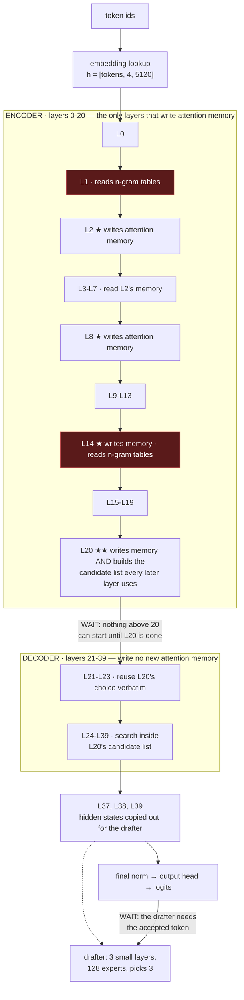
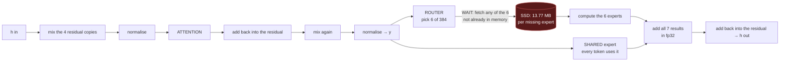
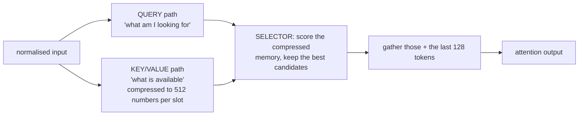
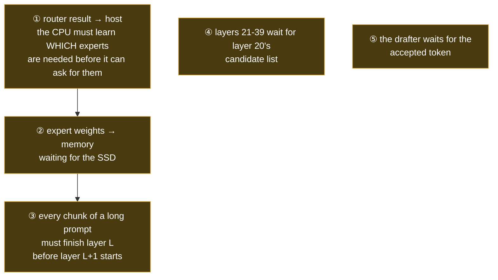

# DeepSeek-V4.1-Flash: what depends on what, and where it waits

The **model's** dependency structure — not our engine's schedule. Everything is read out of the
checkpoint's `inference/config.json` and the reference implementation `tools/v41_ref.py`.

This exists because nearly every scheduling argument in this project turns on one question — *can
this start before that finishes?* — and the answer is a property of the model. It is not obvious
from "40 layers, 384 experts".

Written to be readable without the project's vocabulary. Terms are defined where they first appear,
and collected at the end.

---

## 0. The model in one paragraph

A 40-layer transformer. Each layer does **attention** (look at earlier tokens) then a **feed-forward
network**. The feed-forward part is a *mixture of experts*: instead of one big matrix, there are
**384 small ones per layer** and a tiny **router** picks the **6** most relevant for each token.
384 × 40 = **15,360 experts**, far too many to keep in memory, so most of them live on the SSD and
are fetched when the router asks for them. **That fetching is the only significant I/O, and it is
where nearly all the time goes.**

Two things make this model unusual, and both create scheduling freedom:

- **Only 4 of the 40 layers write the long-term attention memory.** The rest read it.
- **A second, tiny model (the drafter) guesses several tokens ahead** so the big model can verify a
  block of them at once instead of one at a time.

---

## 1. The whole chain

Read top to bottom. **Red** = touches the SSD. **Orange** = a point where execution has to stop and
wait for something.

Every one of the 40 layers also fetches **6 experts per token** from the SSD if they are not already
in memory. That is drawn separately below, because it dominates everything else.

---

## 2. Inside a single layer

Two things worth noticing, because they are the basis of most optimisations here:

- **The shared expert needs only `y`.** It does not wait for the router, for any fetch, or for any
  other expert — yet it is computed after them. That is a choice in the code, not a rule of the model.
- **The 6 routed experts are added together.** Addition does not care about order, so there is no
  requirement that they run at the same time. This is what makes it legal to compute some now and
  the rest when their weights arrive.

---

## 3. Attention has two independent halves

The query and key/value paths share only their input. Neither waits for the other until the selector.

---

## 4. Where the I/O actually is

Only **two** things in this model read from storage. Everything else — attention weights, the
router, the normalisations — is resident in memory the whole time.

| what | when | how much | notes |
|---|---|---|---|
| **routed expert weights** | every layer, every token | **13.77 MB** per expert not already in memory | **this is ~99 % of the I/O.** A 2,048-token chunk asks a single layer for ~300 of its 384 experts |
| **n-gram table rows** | layers **1 and 14** only | **6.3 KB per token per layer**, 12.7 KB for both | tables are 203 GB on disk; a row is 24 lookups × 264 bytes |

For scale: prefilling a 16,776-token prompt reads **~440 GB** of expert weights in the original
chunk-by-chunk order, and **~81 GB** after reordering the loops. The n-gram reads over the same
prompt are ~0.2 GB — a rounding error.

**Nothing else touches the disk during a request.**

---

## 5. Where execution stops and waits

Five distinct waits. They are different in kind, and conflating them has caused real mistakes here.

| wait | what it is | size | can it be removed? |
|---|---|---|---|
| **① router → host** | a blocking copy of the chosen expert ids from GPU to CPU | **18 % of decode time** | not removable — it is a real data dependency. Only *hidden*, by asking for experts before the router has spoken |
| **② SSD fetch** | the CPU asked; now everything stops | **75 % of decode time** | this is the whole game. Overlapping it with compute is what the current work is about |
| **③ layer barrier** | layer L+1 needs layer L's output | — | genuine, unavoidable |
| **④ candidate list** | nothing above layer 20 can begin before it | — | genuine, a consequence of the model's design |
| **⑤ drafter seeding** | the guess depends on the accepted token | — | genuine |

The percentages are measured on this box, three separate runs, and are the reason the project's
effort goes where it does: ② is three quarters of the time, ① is another fifth, and everything the
model actually *computes* is about 5 %.

---

## 6. What may be reordered, and what may not

**Allowed** — the dependency genuinely is not there:

- Visit **layers outermost and chunks innermost**. Each layer's experts are needed only by that
  layer, so fetching them once per layer instead of once per chunk is free. *(Built: 5.4× less I/O.)*
- Compute the **shared expert** while routed experts are still arriving.
- Compute **some routed experts before others**.
- Fetch **n-gram rows** arbitrarily early — their lookup depends on the token ids alone, never on a
  hidden state.
- Start fetching a chunk's experts **as soon as that chunk has routed**, without waiting for the rest
  of the prompt. *(Built; being measured.)*

**Not allowed** — a real dependency:

- Chunk *k+1*'s attention before chunk *k*'s attention **in the same layer**: it reads memory chunk
  *k* just wrote.
- Any layer above 20 before layer 20 has produced its candidate list.
- Layer L+1 before layer L.
- The drafter before the accepted token exists.

**Allowed but unused** — the interesting one:

- Chunk *k*'s feed-forward need not finish before chunk *k+1*'s attention **in the same layer**. Its
  result is not needed until the next layer. This is a genuine pipeline boundary that the
  layer-outermost order creates, and the engine does not exploit it.

---

## 7. Sizes, for judging what is worth overlapping

| | |
|---|---|
| experts in total | 384 per layer × 40 = **15,360** — 222 GB in the 3-bit format |
| experts one layer needs for a 2,048-token chunk | **~300 of 384**; a whole layer's set ≈ **362** |
| cost of one expert fetch | **13.77 MB**, ~2–4 ms depending on how many are in flight |
| a layer's working state for a 32k prompt | `[tokens, 4, 5120]` in bf16 = **1.34 GB** |
| all attention memory at 32k | **285 MB** — because only 4 layers write it, not 40 |
| n-gram tables | 203 GB on disk, 12.7 KB read per token |

---

## Glossary

| term | meaning |
|---|---|
| **expert** | one small feed-forward network. 384 per layer; each token uses 6 |
| **router** | the tiny layer that picks which 6 |
| **shared expert** | the one expert every token always uses, in addition to its 6 |
| **attention memory** (compressed KV) | the compressed record of earlier tokens that attention looks back at. Written by layers 2, 8, 14, 20 only |
| **candidate list** | layer 20's shortlist of which earlier positions are worth looking at; every later layer searches inside it |
| **sliding window** | the last 128 tokens, always visible to attention regardless of the candidate list |
| **encoder / decoder half** | layers 0–20 write attention memory; 21–39 do not. Lets the second half be replayed over just the last 128 tokens of a prompt |
| **n-gram tables (Engram)** | a 203 GB lookup table indexed by the last few token ids, consulted at layers 1 and 14 |
| **drafter (DSpark / MTP)** | a small 3-layer model that guesses ~5 tokens ahead so the big model can verify them in one pass |
| **the 4 residual copies** (hyper-connections) | this model carries 4 parallel residual streams instead of 1, mixed at each sublayer |
| **chunk** | prefill processes a long prompt 2,048 tokens at a time |
| **prefill / decode** | reading the prompt, versus generating tokens one block at a time |
